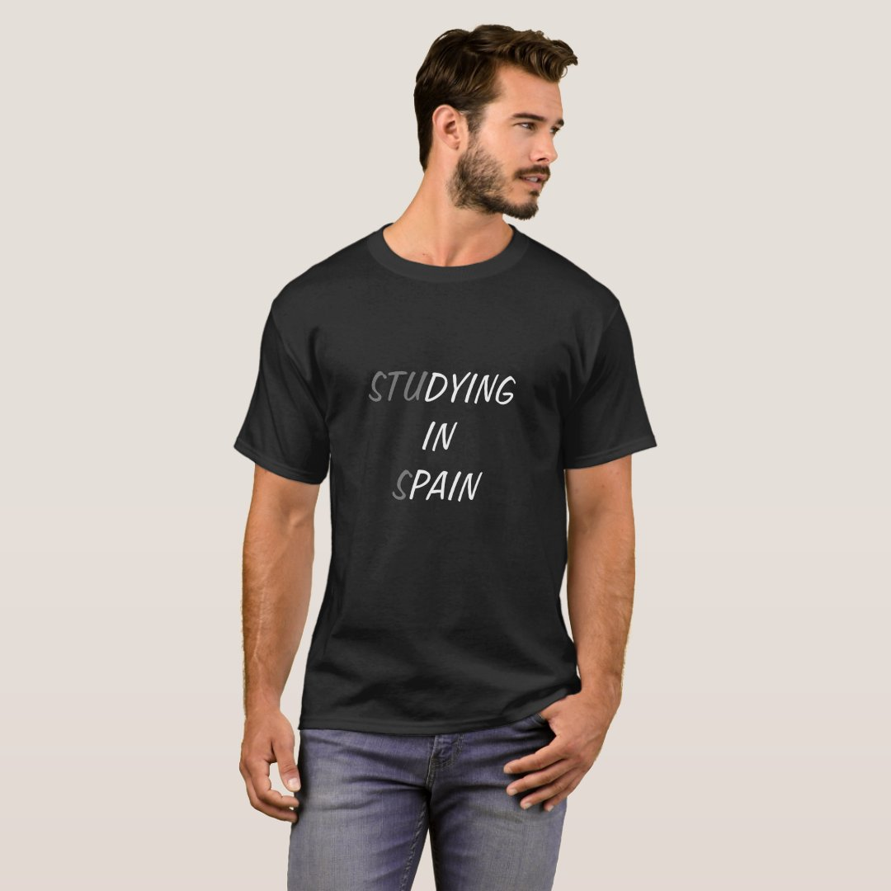
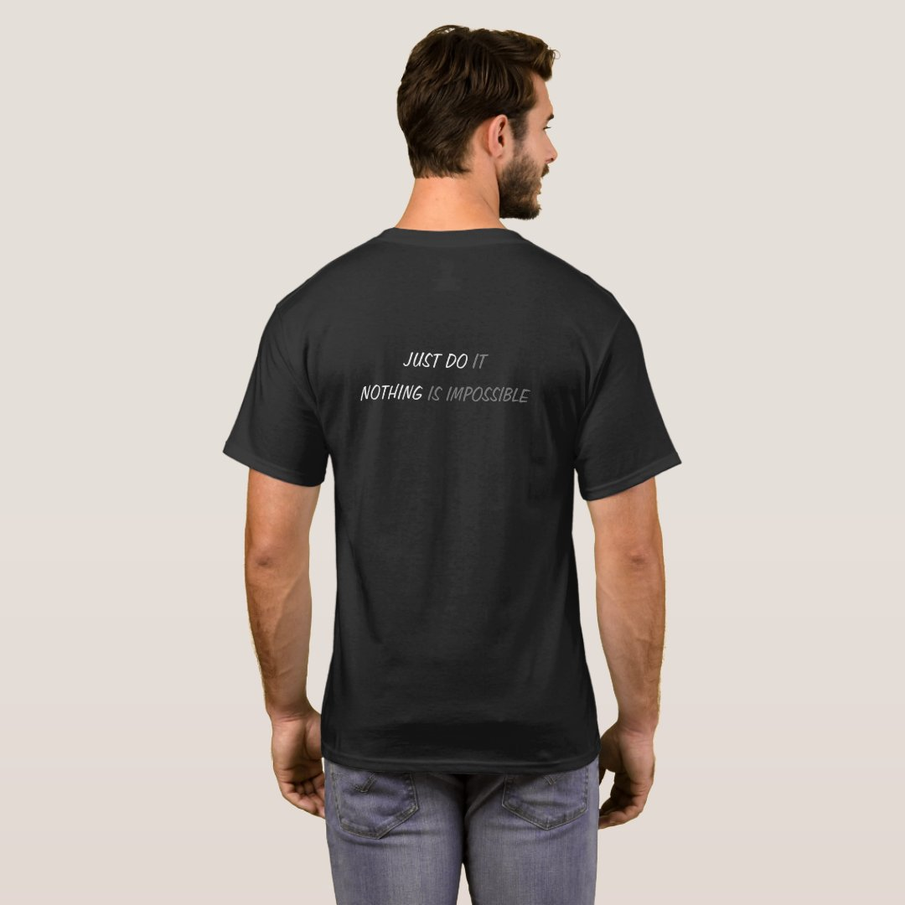
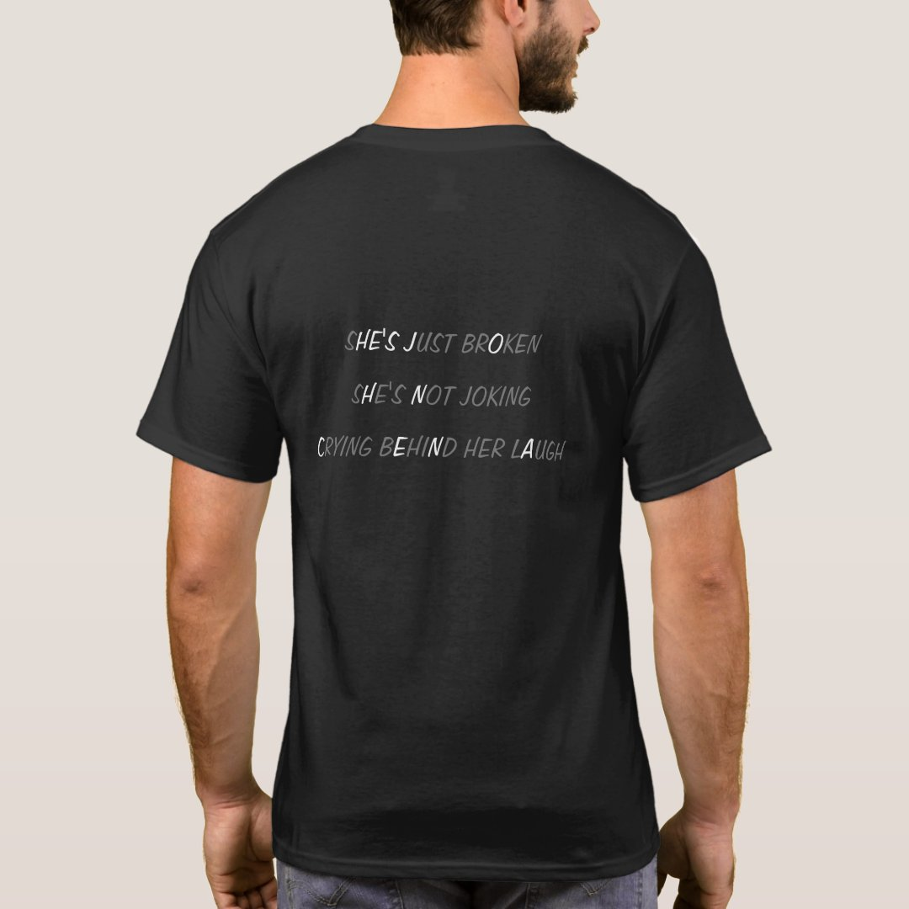

So I made this t-shirt a while ago, and some of my friends said they want to buy it. 
 
 
 
(Yep, this is what I look like irl 100%) 
 
Email me if you are interested. Maybe I will turn this into an e commerce site if I get 10 emails 🤪 
 
 
 
Alternative back design  
 
 
