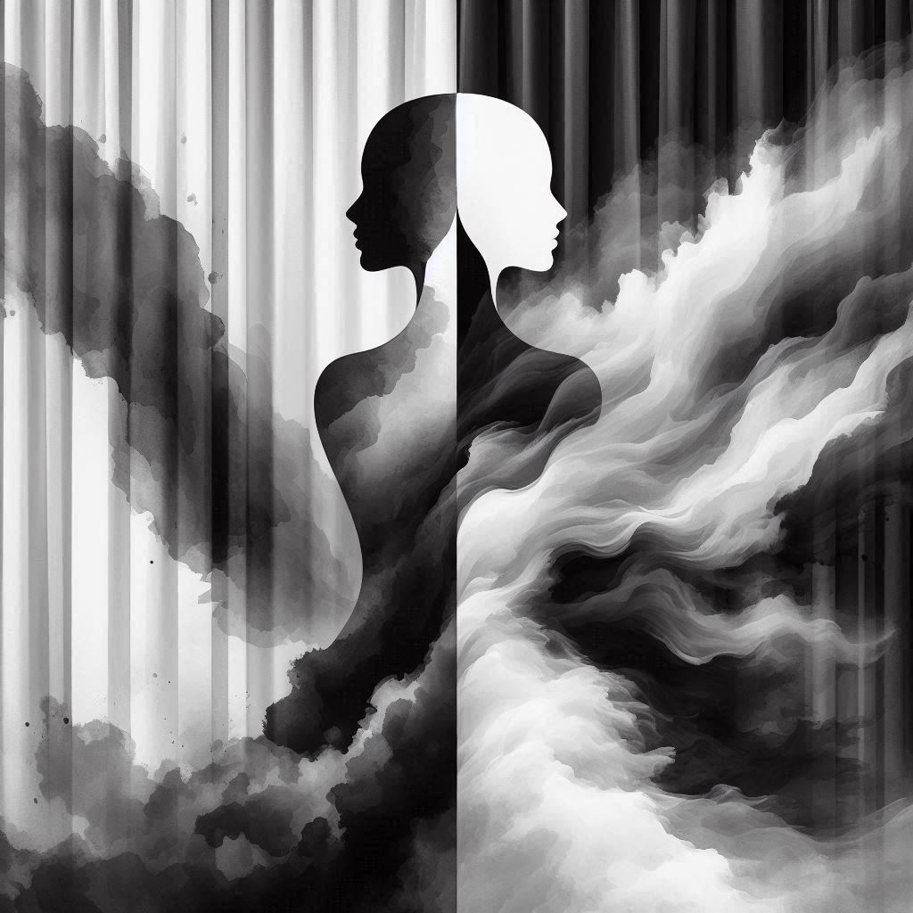

I peek out. 

The curtain hides my anime maid outfit, made from glossy black and white rubbish bags. An auditorium stares back at me. My history teacher, a 60-year-old devout Catholic, glances at my plastic choker and cardboard cat ears…and breaks eye contact. Oops. Those weren't hidden.

What am I doing? 

I’m not an art student. I’m not an anime enthusiast. I’m not a girl. Yet here I am, caught between Angela’s rustling newspaper gown and Jenny’s pink sculptural dress, like a cactus in a rose garden. This is Trash to Fashion, the annual pageant where students rock, well, fashionable trash. 

Why am I here?

I once thought it was the sensation of crossing a line, of doing something atypical and unboyish.

I've always been the contrarian. Back in eighth grade, I drew a line in the sand, insisting that 1 equals 0.999… My whole math class, including the teacher, stood on the opposite side. But I had a proof, so I must’ve been right. That, I thought, was the beauty of Math: all black-and-white, as certain as a checkerboard floor.

But, in a Bayesian Statistics lecture at Atlas, I learned that even math dances with uncertainty. Bayes presents a new perspective on the world: you’re not deciding whether something is true, but rather how likely it’s true. It’s like the sliding scale for your laptop’s screen brightness. Evidence either brightens or dims your belief, but the light is never fully on or off; Bayesians are never certain about anything.

Can the same apply to identity?

The thought lingers as I duck behind the curtain. I tell myself I’m just performing Bayesian updates on the sliding scale of gender—a stroke of eyeliner, a pair of arm-warmers. Yet I can’t help but glance at my teammates, other models, and a rather shocked Mr. Y, who are all scrutinizing my new appearance. My throat tightens with every glare. I’m the contrarian once again, except now the whole school is behind that curtain-marked line. Is this truly me? Do I want to be remembered as the prefect who cross-dressed in front of the whole school? I can’t answer. I’m afraid of making mistakes. 

What did my Atlas instructor say about mistakes? They’re just opportunities to improve your models. No, there’re no “mistakes,” no line separating "right" and "wrong." On a sliding scale, it's just a matter of how close you are to the truth. You can never be exact and that’s okay.

At the end of that Bayesian Statistics class, our instructor had a surprise. They asked us to push the tables aside and form two lines—boys facing girls—the next class would be Swing Dancing. “Underarm pass!” I lifted my arm, leading I into a dizzying twirl. “Sugar push!” We swayed to Taylor Swift, in pairs of leading boys and following girls, still loving the simplicity of black-and-white.

The instructor said class was over, but we could keep practicing.

"Wait a second," I nudged J, "Can I also learn to be a follow?"

Guided by Juan, I change my half-turn into two twirls. It must’ve looked strange—a guy doing a pirouette in an invisible dress—but what I sensed was harmony. The dusk light smoothened the dark edges, transforming the room into the nebulous world Bayes envisioned.

The roar of the crowd brings me back to the auditorium. The gray curtain, an ambiguous shade, but powerful in its own right. Perhaps ambiguity is fine. Perhaps I’m not here to reach any answer or cross any line. These only exist when we see gender as a set of clearly demarcated options. No, as the curtain rises, as I step forward, as darkness bursts into blue and pink spotlights that follow the hem of my dress, I’m simply exploring the crepuscular expanse between the catwalk’s two ends—math and fashion, lead and follow, boy and girl.

